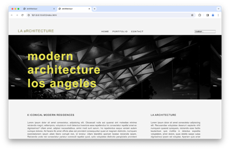
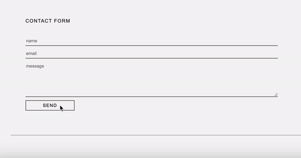
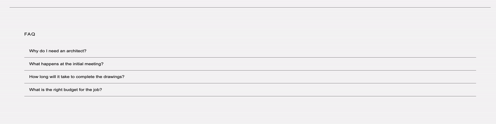

# Labo 17

Zorg dat je de volgende folderstructuur volgt:

```
webtechnologie/
├─ labo-01/
│  ├─ oefening-01/
│  │  ├─ index.html
│  │  ├─ images/
│  │  │  ├─ image-1.jpg 
│  │  │  └─ image-n.jpg 
│  │  ├─ css/
│  │  │   ├─ reset.css
│  │  │   └─ style.css
│  │  └─ js/
│  │     └─ script.js
│  ├─ oefening-02/
│  └─ oefening-n/
├─ labo-02/
└─ labo-n/      
```

- Gebruik steeds JS modules om globale variabelen te vermijden (`<script type="module" src="./path/to/script.js"></script>`)
- Volg de [Coding Guidelines](https://apwt.gitbook.io/webtechnologie/coding-guidelines)
- Maak voor elke oefening een aparte map. Volg de bovenstaande folderstructuur.

## Oefeningen DOM manipulatie

### oefening 1: tekst plaatsen

#### leerdoelen

* een HTML-element selecteren o.b.v. id
* de inhoud van een HTML-element wijzigen

#### functionele analyse

Jouw programma gaat de titel op een website aanpassen naar de inhoud van een variabele.

#### technische analyse

In jouw HTML voorzie je een h1-element met als tekst "Hello world!".

Plaats in jouw code de tekst "Welkom op onze website" in een `const`. Gebruik deze `const` om de `h1` op de website aan te passen.

#### voorbeeldinteractie


### oefening 2: attributen lezen

#### leerdoelen

* een HTML-element selecteren op basis van id
* attributen van een HTML-element lezen

#### functionele analyse

Lees de waarde van het "src"-attribuut van een afbeelding en toon deze in de console.

#### technische analyse

Voeg in jouw HTML een img-element toe met een id, bijvoorbeeld "myImage", en een standaardbron, bijvoorbeeld "afbeelding.png".

In jouw JavaScript-code selecteer je dit img-element op basis van het id "myImage" en lees je de waarde van het "src"-attribuut. Toon deze waarde vervolgens in de console.

#### voorbeeldinteractie


### oefening 3: attributen wijzigen

#### leerdoelen

* een HTML-element selecteren op basis van tag
* attributen van een HTML-element wijzigen

#### functionele analyse

Je moet de bron van een afbeelding wijzigen op basis van een variabele.

#### technische analyse

In jouw HTML heb je een img-element met een id "myImage" en een standaardbron, bijvoorbeeld "afbeelding.png".

Maak in jouw JavaScript-code een variabele met de naam `newSource` en wijs hieraan een nieuwe afbeeldings-URL toe.

Selecteer het img-element op de pagina op basis van het id "myImage" en wijzig het attribuut "src" naar de waarde van de variabele `newSource`. Zo moet de afbeelding op de website veranderen afhankelijk van de nieuwe bron die je hebt opgegeven.

#### voorbeeldinteractie


### oefening 4: stijlen aanpassen

#### leerdoelen

* een HTML-element selecteren op basis van id
* stijlen van een HTML-element wijzigen

#### functionele analyse

Pas de tekstkleur van een alinea aan op basis van een variabele.

#### technische analyse

Voeg in jouw HTML een paar p-elementen toe met verschillende tekstinhoud en verschillende klasses, bijvoorbeeld `.red`.

Maak een variabele met de naam `red` en wijs hieraan een kleurwaarde toe, bijvoorbeeld "rood".

Selecteer de p-elementen op de pagina op basis van de klasse en pas de tekstkleur aan naar de waarde van de variabele. Hierdoor moeten de paragrafen een nieuwe tekstkleur hebben.

#### voorbeeldinteractie


### oefening 5: elementen verwijderen

#### leerdoelen

* bestaande HTML-elementen verwijderen

#### functionele analyse

Verwijder een item uit een lijst.

#### technische analyse

In jouw HTML, creëer een ongeordende lijst (ul) met enkele lijstitems (li).

Selecteer een bestaand lijstitem (je kunt bijvoorbeeld het eerste lijstitem selecteren) en verwijder dit item uit de lijst.

#### voorbeeldinteractie


### oefening 6: tekstinhoud lezen

#### leerdoelen

* een HTML-element selecteren op basis van tag
* de inhoud van een HTML-element lezen

#### functionele analyse

Lees de tekstinhoud van een paragraaf en toon deze in de console.

#### technische analyse

Voeg in jouw HTML een p-element toe met wat tekstinhoud.

In jouw JavaScript-code, selecteer dit p-element op basis van de tag en lees de tekstinhoud ervan. Toon deze tekst vervolgens in de console.

#### voorbeeldinteractie


### oefening 7: stijlen lezen

#### leerdoelen

* een HTML-element selecteren op basis van id
* stijlinformatie van een HTML-element lezen

#### functionele analyse

Lees de achtergrondkleur van een div-element met een specifieke id en toon deze in de console.

#### technische analyse

Voeg in jouw HTML een div-element toe met een id, bijvoorbeeld `bg-grey`, en pas wat stijlen toe, zoals achtergrondkleur.

In jouw JavaScript-code, selecteer dit div-element op basis van de id en lees de achtergrondkleur. Toon deze kleur vervolgens in de console.

#### voorbeeldinteractie


### oefening 8: elementen toevoegen

#### leerdoelen

* nieuwe HTML-elementen maken
* bestaande HTML-elementen wijzigen

#### functionele analyse

Voeg een nieuw item toe aan een lijst.

#### technische analyse

In jouw HTML, creëer een ongeordende lijst (ul) met enkele lijstitems (li).

In jouw JavaScript-code, maak een nieuw li-element aan met de tekst "Nieuw Item" en voeg dit toe aan de bestaande ul. Toon het resultaat in de console.

Deze oefening laat zien hoe je dynamisch nieuwe elementen aan een pagina kunt toevoegen.

#### voorbeeldinteractie


## Oefeningen DOM manipulatie (gevorderd)

- De nodige bestanden staan reeds klaar in deze repository (startbestanden-gevorderd)
- Kopieer deze voor elke oefening.
- In je browser zou je het volgende moeten zien als je de pagina opent: 

### oefening 9: formuliervalidatie

Je zal het formulier afhandelen in JavaScript.

#### functionele analyse

* Zorg dat een error-bericht wordt getoont wanneer een veld niet ingevuld is.
* Zorg dat een success-bericht wordt getoont wanneer alle velden juist ingevuld zijn met daarin de waardes van het name, email en message veld.

#### technische analyse

* Maak een bestand form.js.
* Koppel het bestand form.js aan de index.html.
* Geef het form-element een id en haal het op in je form.js met querySelector.
* Voeg een submit-eventlistener toe aan form.
* Haal de 3 velden op en kijk na of ze zijn ingevuld.
* niet ingevuld: geef een foutmelding
* ingevuld: geef een succesmelding
* Toon de ingevulde waarden aan de gebruiker via een `alert`.

#### voorbeeldinteractie




### oefening 10: frequently asked questions sectie (FAQ)

#### functionele analyse

* Maak een inklapbare FAQ met behulp van JavaScript.
* Voeg HTML toe zoals visueel weergegeven in de voorbeeldinteractie.
* Elk inklapbaar element bestaat uit:
* een button met class `collapsible`
* een p-element met class `context`

#### technische analyse

* Haal in faq.js alle elementen op met de klasse 'collapsible' en gebruik hierbij querySelectorAll.
* Loop over de array van elementen.
* Voeg voor elk element een 'click' eventlistener toe.
* Als er op een ingeklapt element wordt geklikt, wordt de inhoud zichtbaar.
* Als er op een opengeklapt element wordt geklikt, wordt de inhoud onzichtbaar.

#### voorbeeldinteractie



### oefening 11: social media icons

#### functionele analyse

* Plaats de social media icons op het scherm vanuit JavaScript
* Voeg HTML toe zoals visueel weergegeven in de voorbeeldinteractie.
* Elk social media icon bestaat uit:
  * een li-element
  * een a-element met een juiste link
  * een img-element met een juist icoon

#### technische analyse

* Maak een `socials.js`-bestand aan en plaats hierin de volgende arrays:
```javascript
const socialPlatforms = ["youtube", "instagram", "facebook", "twitter"];
const socialLinks = ["https://www.youtube.com", "https://www.instagram.com/", "https://www.facebook.com/", "https://twitter.com/"];
```

* Selecteer het `ul`-element met ID `socials` en voeg hier met behulp van JavaScript per social media platform de nodige elementen aan toe, bijvoorbeeld:
```html
<li>
 <a href="https://www.youtube.com" target="_blank">
    
 </a>
</li>
 ```

#### voorbeeldinteractie


