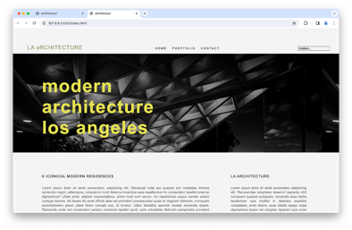

# startbestanden-9

Dit is geen oefening op zich. Deze map bevat de startbestanden voor **oefening 9: social media icons** van labo 17: een `index.html`, de bijhorende CSS en de afbeeldingen in `assets`.

Kopieer deze map naar je eigen oefeningenmap en volg verder de opgave in de [README van labo 17](../README.md).

Als je de pagina opent in je browser, zie je dit:

